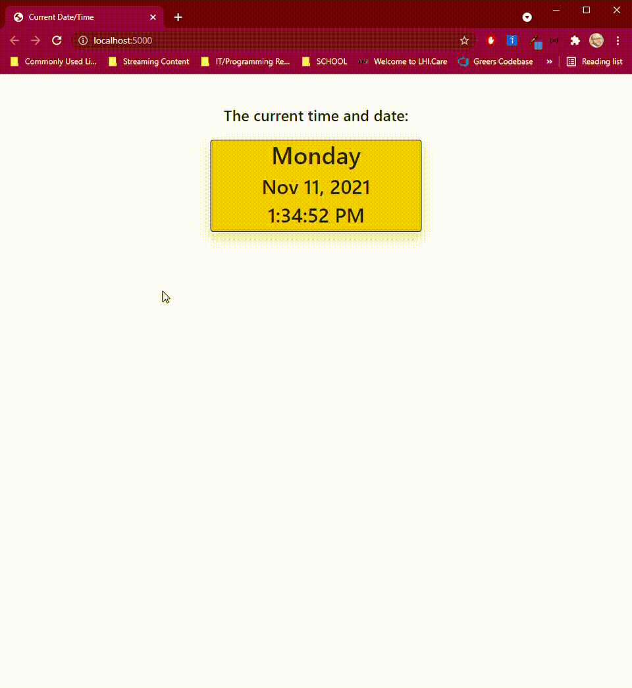

# TimeDisplay

This is a simple application that shows the current Day, Date, and Time live to the second utilizing an MVC structure in .NET.
The time is kept live using script that starts on load and refreshed each second without refreshing the whole page.

